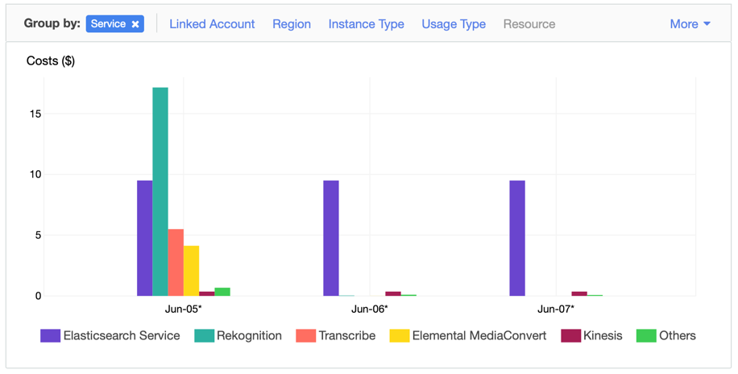

# MEDIA INSIGHTS APPLICATION

This application is a demo reference application for the [Media Insights Engine](https://github.com/awslabs/aws-media-insights-engine) (MIE). It catalogs videos and images with data generated by AWS AI services for computer vision and speech detection. A graphical user interface (GUI) enables users to search through the catalog to find videos or images containing certain content and to analyze what the cataloged data looks like for selected files.


# INSTALLATION

The following Cloudformation templates will deploy the Media Insights front-end application with a prebuilt version of the most recent MIE release.  

Region| Launch
------|-----
US East (N. Virginia) | [](https://console.aws.amazon.com/cloudformation/home?region=us-east-1#/stacks/new?stackName=mie&templateURL=https://rodeolabz-us-east-1.s3.amazonaws.com/content-analysis-solution/v2.0.0/cf/aws-content-analysis-deploy-mie.template)
US West (Oregon) | [](https://console.aws.amazon.com/cloudformation/home?region=us-west-2#/stacks/new?stackName=mie&templateURL=https://rodeolabz-us-west-2.s3.amazonaws.com/content-analysis-solution/v2.0.0/cf/aws-content-analysis-deploy-mie.template)

For more installation options, see the [Advanced Installation](#advanced-installation-options) section.

# COST

You are responsible for the cost of the AWS services used while running this application. The primary cost factors are from using Amazon Rekognition and Amazon Elasticsearch Service (Amazon ES). Videos cost about $0.50 per minute to process, but can vary between $0.10 per minute and $0.60 per minute depending on the video content. If you disable Amazon Rekognition in your workflow configuration, then video costs can decrease to approximately $0.04 per minute. Data storage and Amazon ES will cost approximately ***$10.00 per day*** regardless of the quantity or type of video content.

After a video is uploaded into the solution, the costs for processing are a one-time expense. However, data storage costs occur daily, as shown in the following screenshot from AWS Cost Explorer.



For more information about cost, see the pricing webpage for each AWS service you will be using in this solution. If you need to process a large volume of videos, we recommend that you contact your AWS account representative for at-scale pricing. 

# Analysis Workflow

After uploading a video or image in the GUI, the application runs a workflow in MIE that extracts insights using a variety of media analysis services on AWS and stores them in a search engine for easy exploration. The following flow diagram illustrates this workflow:


This application includes the following features:

* Proxy encode of videos and separation of video and audio tracks using **AWS Elemental MediaConvert**. 
* Object and activity detection in images and video using **Amazon Rekognition**. 
* Celebrity detection in images and video using **Amazon Rekognition**
* Face search from a collection of known faces in images and video using **Amazon Rekognition**
* Facial analysis to detect facial features and faces in images and videos to determine things like happiness, age range, eyes open, glasses, facial hair, etc. In video, you can also measure how these things change over time, such as constructing a timeline of the emotions expressed by an actor.  From **Amazon Rekognition**.
* Unsafe content detection using **Amazon Rekognition**. Identify potentially unsafe or inappropriate content across both image and video assets.
* Detect text in videos and images using **Amazon Rekognition**.
* Video segment detection using **Amazon Rekognition**. Identify black frames, color bars, end credits, and scene changes.
* Identify start, end, and duration of each unique shot in your videos using **Amazon Rekognition.** 
* Convert speech to text from audio and video assets using **Amazon Transcribe**.
* Convert text from one language to another using **Amazon Translate**.
* Identify entities in text using **Amazon Comprehend**. 
* Identify key phrases in text using **Amazon Comprehend**

Users can enable or disable operators in the upload view shown below:


# Search Capabilities:

The search field in the Collection view searches the full media content database in Elasticsearch. Everything you see in the analysis page is searchable. Even data that is excluded by the threshold you set in the Confidence slider is searchable. Search queries must use valid Lucene syntax.

Here are some sample searches:

* Since Content Moderation returns a "Violence" label when it detects violence in a video, you can search for any video containing violence simply with: `Violence`
* Search for videos containing violence with a 80% confidence threshold: `Violence AND Confidence:>80` 
* The previous queries may match videos whose transcript contains the word "Violence". You can restrict your search to only Content Moderation results, like this: `Operator:content_moderation AND (Name:Violence AND Confidence:>80)`
* To search for Violence results in Content Moderation and guns or weapons identified by Label Detection, try this: `(Operator:content_moderation AND Name:Violence AND Confidence:>80) OR (Operator:label_detection AND (Name:Gun OR Name:Weapon))`  
* You can search for phrases in Comprehend results like this, `PhraseText:"some deep water" AND Confidence:>80`
* To see the full set of attributes that you can search for, click the Analytics menu item and search for "*" in the Discover tab of Kibana.

# Developers

Join our Gitter chat at [https://gitter.im/awslabs/aws-media-insights-engine](https://gitter.im/awslabs/aws-media-insights-engine). This public chat forum was created to foster communication between MIE developers worldwide.

[](https://gitter.im/awslabs/aws-media-insights-engine)

For instructions on how to build and deploy MIE (the framework) and the Media Insights front-end application from source code, read the  [Implementation Guide](IMPLEMENTATION_GUIDE.md).

# Advanced Installation Options

## Deploying the demo app over an existing MIE stack

The following Cloudformation templates can be used to deploy the MIE front-end reference application over an MIE stack that you have already deployed.

Region| Launch
------|-----
US East (N. Virginia) | [](https://console.aws.amazon.com/cloudformation/home?region=us-east-1#/stacks/new?stackName=mie&templateURL=https://rodeolabz-us-east-1.s3.amazonaws.com/content-analysis-solution/v2.0.0/cf/aws-content-analysis.template)
US West (Oregon) | [](https://console.aws.amazon.com/cloudformation/home?region=us-west-2#/stacks/new?stackName=mie&templateURL=https://rodeolabz-us-west-2.s3.amazonaws.com/content-analysis-solution/v2.0.0/cf/aws-content-analysis.template)

## Building the demo app from source code

The following commands will build the MIE demo application from source code. Be sure to define values for `EMAIL`, `WEBAPP_STACK_NAME`, and `REGION` first.

```
EMAIL=[specify your email]
WEBAPP_STACK_NAME=[specify a stack name]
REGION=[specify a region]
VERSION=1.0.0
git clone https://github.com/awslabs/aws-media-insights
cd aws-media-insights
cd deployment
DATETIME=$(date '+%s')
DIST_OUTPUT_BUCKET=media-insights-engine-frontend-$DATETIME
aws s3 mb s3://$DIST_OUTPUT_BUCKET-$REGION --region $REGION
./build.sh $DIST_OUTPUT_BUCKET-$REGION $VERSION $REGION
```

Once you have built the demo app with the above commands, then it's time to deploy it. You have two options, depending on whether you want to deploy over an existing MIE stack or a new one:

#### *Option 1:* Install demo app only

Use these commands to deploy the demo app over an existing MIE stack:

```
MIE_STACK_NAME=[specify the name of your exising MIE stack]
TEMPLATE=[copy "With existing MIE deployment" link from output of build script]
aws cloudformation create-stack --stack-name $WEBAPP_STACK_NAME --template-url $TEMPLATE --region $REGION --parameters ParameterKey=MieStackName,ParameterValue=$MIE_STACK_NAME ParameterKey=AdminEmail,ParameterValue=$EMAIL --capabilities CAPABILITY_IAM CAPABILITY_NAMED_IAM CAPABILITY_AUTO_EXPAND --profile default --disable-rollback
```

#### *Option 2:* Install MIE framework AND demo app

Use these commands to deploy the demo app over a new MIE stack:

```
TEMPLATE=[copy "Without existing MIE deployment" link from output of build script]
aws cloudformation create-stack --stack-name $WEBAPP_STACK_NAME --template-url $TEMPLATE --region $REGION --parameters ParameterKey=AdminEmail,ParameterValue=$EMAIL --capabilities CAPABILITY_IAM CAPABILITY_NAMED_IAM CAPABILITY_AUTO_EXPAND --profile default --disable-rollback
```

When finished your stack should look like this:


